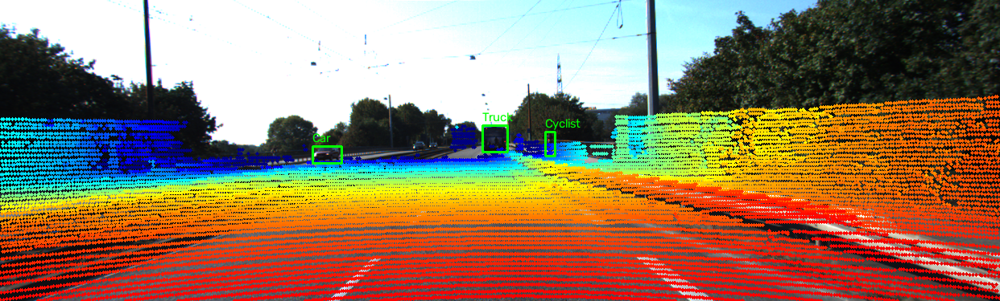

# Báo cáo Day 6: Đánh giá độ nhạy của projection LiDAR-camera với calibration drift

> Thay **mọi** ô có chữ ĐIỀN nằm trong ngoặc vuông bằng nội dung của bạn, xoá luôn cả dấu ngoặc vuông. Lệnh `python tools/check_submission.py` sẽ báo FAIL nếu còn sót bất kỳ chỗ nào.

- **Họ tên:** Ngo The Viet
- **MSSV:** 02594 (phải trùng với MSSV trong tên repo `<HoVaTen>-<MSSV>-Track4-Day21`)
- **Lớp:** Track 4 — Computer Vision and Robotics
- **Link repo:** https://github.com/TheViet298/NgoTheViet-02594-Track4-Day21
- **Topic:** A — LiDAR-camera projection QA
- **Dataset:** data/kitti_mini; data/synthetic dùng để kiểm tra projection cơ bản
- **Các frame đã dùng:** 000001, 000011, 000049

> Hãy viết ngắn: mỗi mục từ 3 đến 8 dòng, ưu tiên số liệu và hình ảnh.

## 1. Claim

Một câu khẳng định kỹ thuật có thể kiểm chứng. Ví dụ: *"Lệch yaw 1° làm 12% điểm LiDAR rơi ra khỏi vật thể ở 30 m, phát hiện được bằng edge-alignment score với ngưỡng X."*

Calibration yaw drift ảnh hưởng rõ đến tỷ lệ điểm LiDAR nằm trong các 2D box, nhưng hướng thay đổi phụ thuộc vào cảnh. Trong frame `000001`, tăng yaw từ 0° lên 3° làm tỷ lệ này giảm từ `0.0956%` xuống `0.0316%`; ở `000011` và `000049`, tỷ lệ lại tăng nhẹ. Vì vậy, một metric gộp đơn giản trên nhiều cảnh không đủ để kết luận calibration đúng hay sai.

## 2. Evidence

Bảng hoặc plot số liệu, kèm ảnh/video demo. Ghi rõ đường dẫn file trong `results/`.

| Cấu hình / mức perturb | Metric 1 | Metric 2 | Ghi chú |
|---|---|---|---|
| Yaw 0° | 15.49% / 18.47% / 15.91% | 0.0956% / 1.5074% / 6.8589% | Frame `000001` / `000011` / `000049` |
| Yaw 1° | 15.49% / 18.47% / 15.99% | 0.0624% / 1.5333% / 6.9346% | Frame `000001` giảm, hai frame còn lại tăng nhẹ |
| Yaw 2° | 15.49% / 18.48% / 16.03% | 0.0358% / 1.5953% / 6.9812% | Xu hướng phụ thuộc scene |
| Yaw 3° | 15.49% / 18.47% / 16.04% | 0.0316% / 1.6240% / 7.0093% | Cần xem từng frame, không chỉ mean |


## 3. Failure case

Nêu khi nào hệ thống hoặc phương pháp fail, vì sao fail, và liên hệ tới lớp nào trong 6 lớp debug: I/O, Geometry, Time, Preprocess, Model, Metric.



Failure rõ nhất nằm ở frame `000001`: yaw drift 3° làm tỷ lệ điểm nằm trong 2D box giảm còn `0.0316%`, so với `0.0956%` ở yaw 0°. Tuy nhiên, metric gộp trên cả ba frame lại tăng từ `2.8206%` lên `2.8883%` vì hai frame còn lại có nhiều box hơn và tỷ lệ điểm trong box tăng nhẹ. Đây là failure của lớp Metric: chỉ dùng mean gộp cảnh có thể che mất lỗi calibration ở một cảnh cụ thể. Cần báo cáo theo từng frame/object và kèm ảnh overlay.

## 4. Khuyến nghị nếu triển khai thật

Trong ADAS, calibration drift cần được theo dõi trước khi dùng LiDAR-camera để hỗ trợ phát hiện vật thể. Không nên dùng một mean metric trên nhiều cảnh; hệ thống cần log theo frame/object, tỷ lệ điểm trong ảnh, tỷ lệ điểm trong box, timestamp và trạng thái calibration. Đánh đổi là kiểm tra theo object chi tiết hơn nhưng tốn thêm bộ nhớ và thời gian. Bước tiếp theo là bổ sung edge-alignment score và cảnh báo khi nhiều object nhỏ cùng lệch.

## 5. Cách chạy lại

Các lệnh tái tạo lại toàn bộ kết quả từ repo sạch.

```bash
python -m starter.data_health --data-root data/synthetic
python -m starter.projection --data-root data/synthetic --frame 000000
python -m starter.projection --data-root data/kitti_mini --frame 000011
python -m src.topic_a_yaw_sweep --data-root data/kitti_mini
python -m starter.projection --data-root data/kitti_mini --frame 000001 --yaw-deg 3.0
python tools/check_submission.py
```

## 6. Khai báo sử dụng AI

Ghi rõ đã dùng công cụ AI nào, dùng vào việc gì, và bạn đã tự kiểm chứng kết quả đó bằng cách nào. Nếu không dùng AI, ghi "Không sử dụng". Xem quy định ở `RULES.md` mục 2.

| Công cụ | Dùng cho việc gì | Bạn đã kiểm chứng thế nào |
|---|---|---|
| ChatGPT/Codex | Hỗ trợ đọc cấu trúc repo, triển khai hai hàm projection, tạo script benchmark và diễn giải kết quả | Đã chạy lại projection, benchmark, kiểm tra cú pháp và kiểm tra trực quan các ảnh overlay/failure trong repo |
